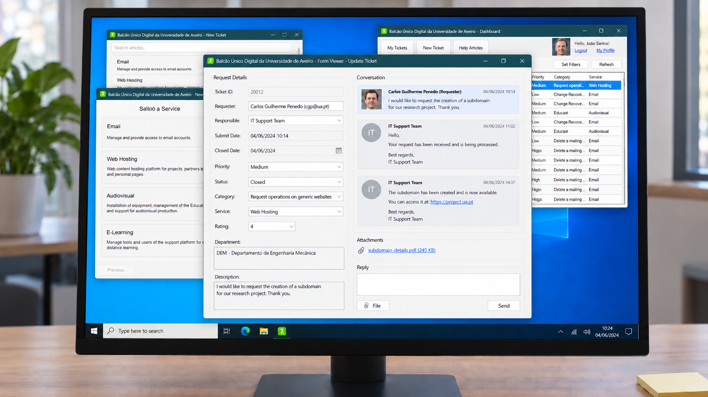
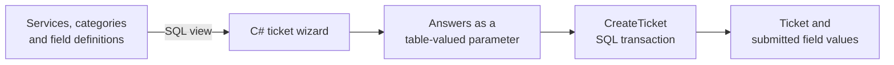

# BUD - A University Helpdesk Built Around Its Database

BUD is a desktop helpdesk for requesting university IT services and following those requests through to resolution. A ticket brings together the information needed for a particular service, its priority and status, and the conversation between the requester and IT staff, including file attachments.

I built it with **Miguel Reis in 2024** for the Databases course at the University of Aveiro. The application is written in **C# with Windows Forms and SQL Server**. Much of the interesting work sits at the boundary between the two: the database describes the ticket forms, stores their answers, and handles operations such as creating, closing, and reopening a request.

*A request for a project email account, with the staff controls and conversation in one window.*

[Watch the original demo](video_demo.mp4) · [Setup and technical documentation](DOCUMENTATION.md) · [Original project report](apft_submit.pdf)

## Why We Built It

The starting point was the university's **Balcão Único Digital**, the central point of contact for its IT and communications services, known as STIC. Students, teachers, and administrative employees need to request things such as an email account for a project, changes to a website, access to an e-learning course, or a network connection in a room.

Those requests need different information. Creating an email account calls for a desired address and a project name. Changing a physical network connection calls for a location. A useful ticketing system has to collect the right details, let staff act on the request, and keep follow-up questions attached to it.

We used that setting to build our own implementation. It gave the database design a practical purpose: represent several kinds of request without creating a separate table and a separate screen for every one of them.

## What It Does

- Builds a ticket form from the selected service and category, with the available categories filtered by the user's roles.
- Gives requesters a list of their own tickets, with filters for service, category, priority, and status.
- Gives staff a shared queue with pages of 20 tickets, status and priority editing, reopening, and deletion.
- Keeps messages and downloadable attachments inside each ticket.
- Lets requesters rate a closed ticket from zero to five and gives staff a dashboard of ticket counts.
- Provides searchable help articles and a profile showing role and department memberships, their dates, and an editable profile picture.

## Letting the Database Describe the Form

The ticket wizard starts with a service, then a category. Choosing **Email → Create an email account for project, event or institution**, for example, produces fields for the department, desired email address, project name, and responsible person.

The form comes from four related tables: `service`, `category`, `field`, and `category_field`. The [`ServiceCategoriesFields` view](db/06_views.sql) joins them into a result that the client turns into service cards, category cards, and input controls. A category also carries a minimum role, which the client compares with the user's highest role ID when loading the wizard.

Adding a category or an ordinary text field means adding the corresponding database records and associations. The C# form renderer can then display it without another screen being written. Department and room selectors are special cases implemented in C#; the database does not yet describe arbitrary input types or validation rules.

There is a second distinction in the model that matters after submission: `category_field` describes what a form asks for, while `ticket_field` stores what a person actually submitted. Changing a category's field associations does not erase those existing answers. The field definitions themselves still need to remain in the database because the answers reference them.

## Submitting the Whole Request Together

When the user presses Submit, the client gathers the category-specific answers into a `DataTable` and sends it to SQL Server as a **table-valued parameter**. The [`CreateTicket` procedure](db/02_sp.sql) inserts the ticket, retrieves its generated ID, and inserts all of its answers within one transaction.

That transaction makes the request one operation: if an answer cannot be inserted, the ticket insert rolls back too. It also keeps the number of form fields out of the procedure's signature. The same operation accepts a short email request or a different category with a different set of fields.

The application connects directly to SQL Server through ADO.NET's `System.Data.SqlClient`. Forms use parameterized queries for reads and stored procedures for most writes. The repository includes the schema, procedures, views, triggers, indexes, and sample data alongside the desktop client.

## Following a Ticket Through the Helpdesk

Requesters use **My Tickets** to revisit a request and continue the conversation. Staff have an additional **Manage Tickets** section, where they can open any ticket, change its priority or status, and delete it. Updating a ticket from that screen also records the staff member performing the update as the responsible user.

Both lists use the same `SeeUserTickets` procedure. Passing a requester ID returns that person's tickets; the staff view passes no requester ID and supplies pagination parameters. Service, category, status, and priority filters are applied in SQL before the page is returned. In the filter dialog, selecting a service also narrows the list of categories.

The conversation supports text messages and file attachments. When a user uploads a file, `SendAttachmentMessage` saves an attachment message and the file together in a transaction. The file bytes live in SQL Server as `VARBINARY(MAX)`, linked to the message and ticket. The viewer displays an attachment link that lets the user save and open the file.

Closing a ticket records its closure date. When the requester opens a closed, unrated ticket, the application offers a rating from zero to five. Reopening it clears both the closure date and the previous rating through a database trigger, so the old resolution does not remain attached to an active request. Deleting a ticket also removes its messages, attachments, and submitted field values.

These are small rules, but they make a difference to what the records mean. A closed request, a reopened request, and a rated resolution are different situations, and the database needs to reflect that.

## Help Articles and People Behind the Tickets

The help article browser covers the same service catalogue. Users can search article titles and content, then open the full text with its author, publication date, and associated service. This gives someone a place to look for instructions before opening a request.

A person can have more than one university role or belong to more than one department. The data model keeps those associations in separate tables, with start and end dates. The profile page displays them alongside the user's name, email, and profile picture.

  

Profile pictures have their own table and are fetched separately. Loading identity and membership details therefore does not require loading the image bytes as well. The [original relational diagram](ER.png) shows how these records connect to the rest of the system.

## Trying the Queries with 20,000 Tickets

The sample-data script generates **20,000 tickets** across four email request categories. That gave us enough data to exercise the staff queue and compare a few common queries with and without indexes.

We added indexes on the ticket's requester, priority, and status columns. The [saved experiment](IndexesTesting.rpt) records these timings:

| Query filter | Without index | With index |
| --- | ---: | ---: |
| Requester ID | 110 ms | 34 ms |
| Priority ID | 47 ms | 13 ms |
| Status ID | 63 ms | 47 ms |

These are measurements from the original development run. The [test script](db/09_test_indexes.sql) times one execution of each query before and after creating the indexes; it does not control for caching or repeat runs. The results were useful for exploring how an index affects these access patterns, but they do not establish an application-wide speedup.

## Looking Back at the Design

The part I find most interesting is how much of the application follows from the data model. Category definitions become input controls. Submitted answers remain attached to their tickets. Transactions group related writes, and triggers handle cleanup and reopening rules. The database has a direct role in the behavior someone sees on screen.

There are also clear next steps. The desktop client connects directly to SQL Server using shared database credentials, and role checks largely control the interface. If I revisited it for deployment, I would start with a service layer that enforces permissions for each operation. I would also extend the form metadata to describe input types and validation, removing the special cases for department and room fields.

This repository preserves the 2024 coursework implementation. The [implementation notes](DOCUMENTATION.md#implementation-notes) cover its remaining edge cases, including role dates, statistics labels, and procedure error handling.

## Exploring the Repository

| Path | Contents |
| --- | --- |
| [ui/BUD/Forms/](ui/BUD/Forms/) | Authentication, dashboard, ticket wizard and viewer, filters, ratings, articles, and profile screens |
| [ui/BUD/CustomControls/](ui/BUD/CustomControls/) | Reusable service cards, article cards, and form inputs |
| [ui/BUD/Entities/](ui/BUD/Entities/) | User, service, and category models, database connection, and application entry point |
| [db/](db/) | SQL Server schema, stored procedures, functions, triggers, views, indexes, and data scripts |
| [screenshots/](screenshots/) | Screenshots of the original application |
| [DOCUMENTATION.md](DOCUMENTATION.md) | Local setup, database reference, implementation notes, and coursework material |

To run it, open [`ui/BUD/BUD.sln`](ui/BUD/BUD.sln) in Visual Studio with **Windows Forms and .NET Framework 4.7.2** support, prepare a SQL Server database, and update the connection settings. The [setup guide](DOCUMENTATION.md#setup) gives the script order and demo accounts.

Developed by **Miguel Vila and Miguel Reis**. Released under the [MIT License](LICENSE).
